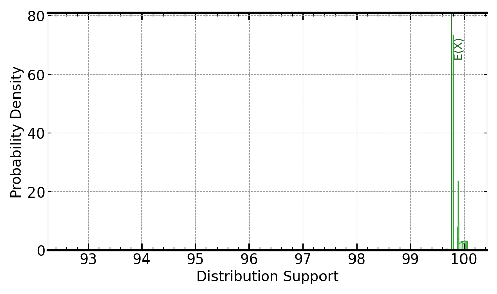
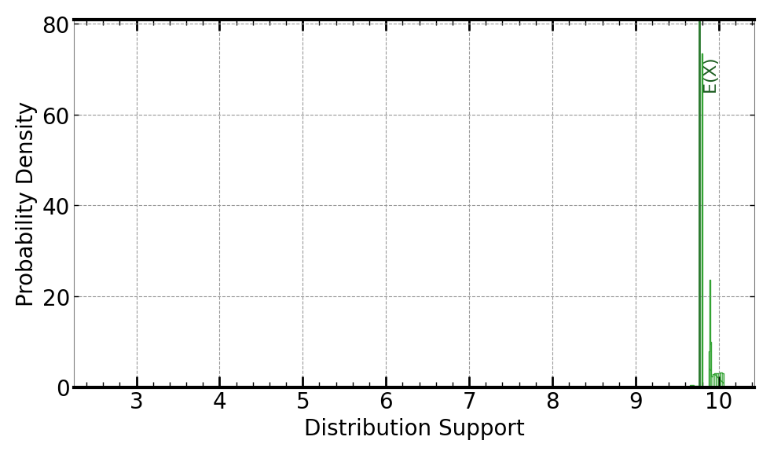
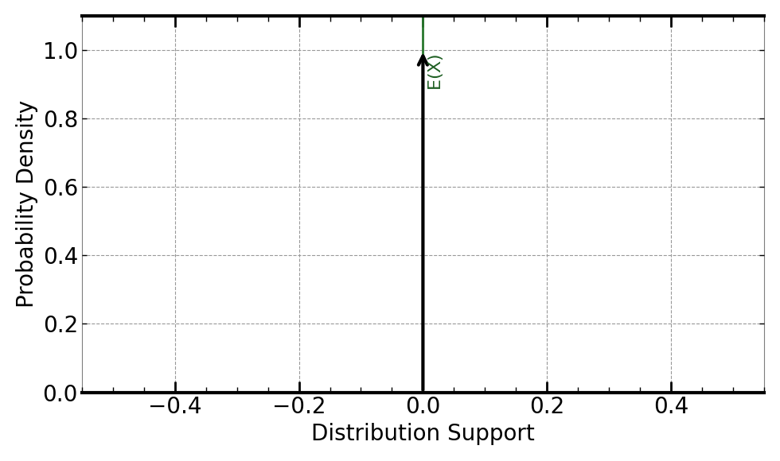
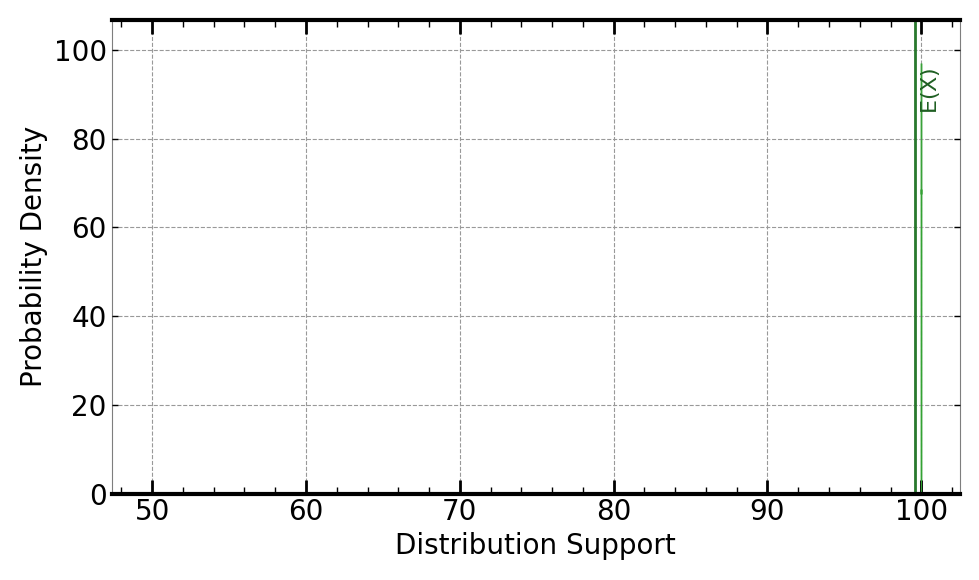
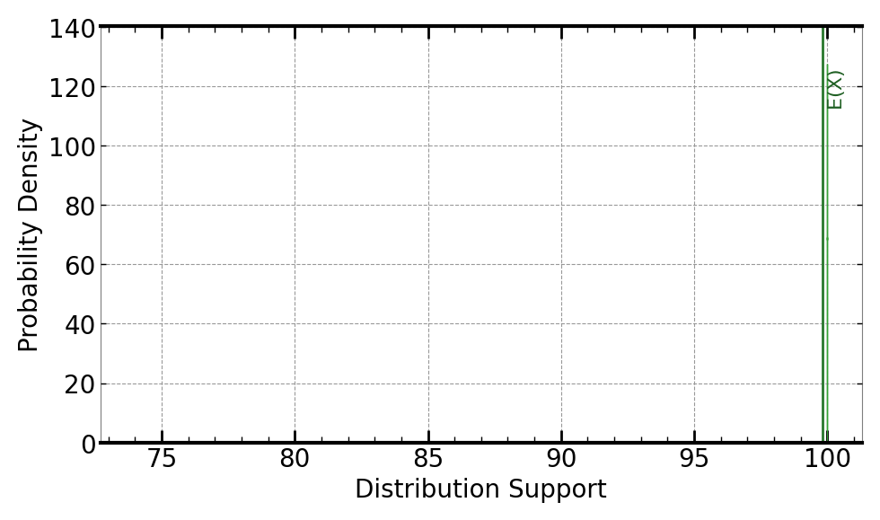
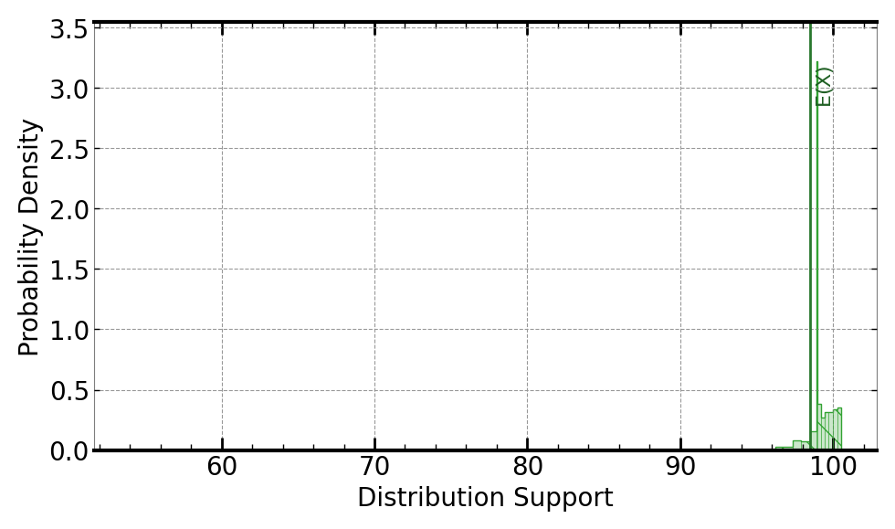
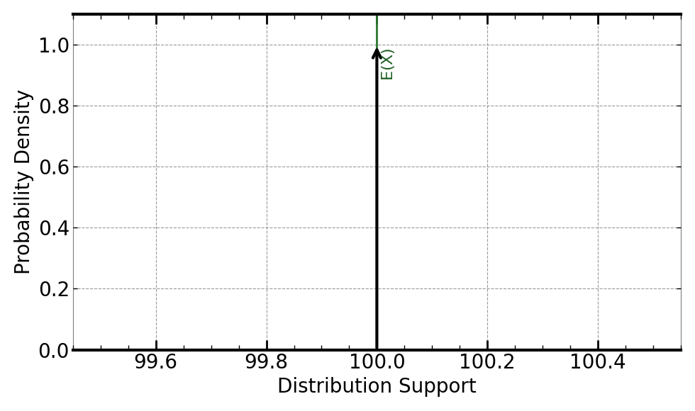

# Distributions

Probability density functions generated from 1,000 Lighthouse audits of [www.ronnie.tech](https://www.ronnie.tech).

## Composite score

| Score | Margin vs Good (90) | P(score < 90) |
| ----- | ------------------- | ------------- |
| 99.77 | +9.77               | ≈ 0           |

 

The composite score distribution is tightly concentrated near the upper end of the scale. The margin plot confirms consistent clearance above the 90 threshold across runs.

---

## Per-metric

  

| Metric | Mean  | Notes                                     |
| ------ | ----- | ----------------------------------------- |
| FCP    | 99.59 | Tight distribution, low variance          |
| LCP    | 99.82 | Tight distribution, low variance          |
| SI     | 98.52 | Widest spread, primary uncertainty source |

 

| Metric | Mean   | Notes                                 |
| ------ | ------ | ------------------------------------- |
| TBT    | 100.00 | No variance, constant across all runs |
| CLS    | 100.00 | No variance, constant across all runs |

TBT and CLS collapse to point masses at 100, contributing zero uncertainty to the composite. Speed Index is the only metric with meaningful spread, driving what little variance exists in the final score.
